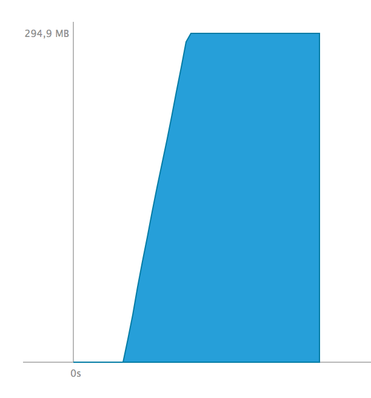

Performances
============

Le test de performance présenté ici consiste en la création de X éléments, et en la mesure du
temps que met le programme à les traiter. Pour ce faire, on créer un fichier contenant X lignes de commandes cohérentes,
puis ce fichier est chargé dans le programme.

## Mesures

| `x`     | `user`  | `sys`  | `real`  |
|---------|---------|--------|---------|
| 1000    | 0.044s  | 0.003s | 0.048s  |
| 10000   | 2.147s  | 0.015s | 2.166s  |
| 100000  | 5m5.7s  | 0m0.3s | 5m6.2s  |
| 1000000 | 100000m | 10s    | 100000m |

